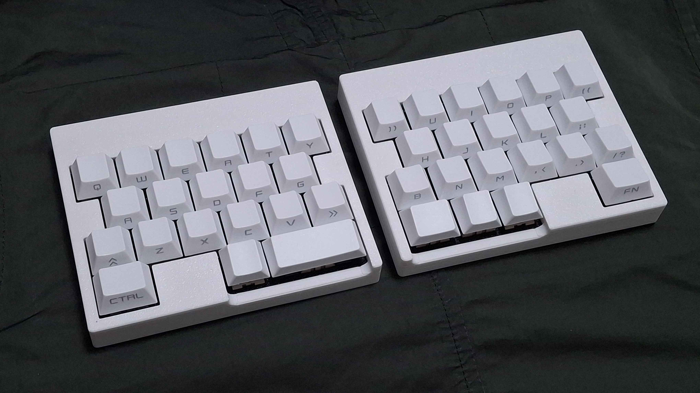
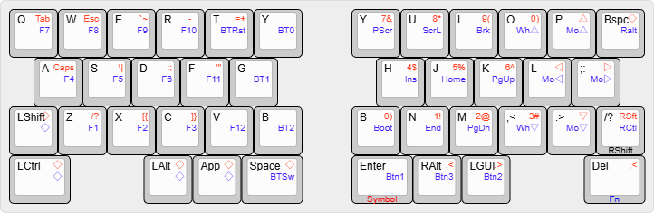
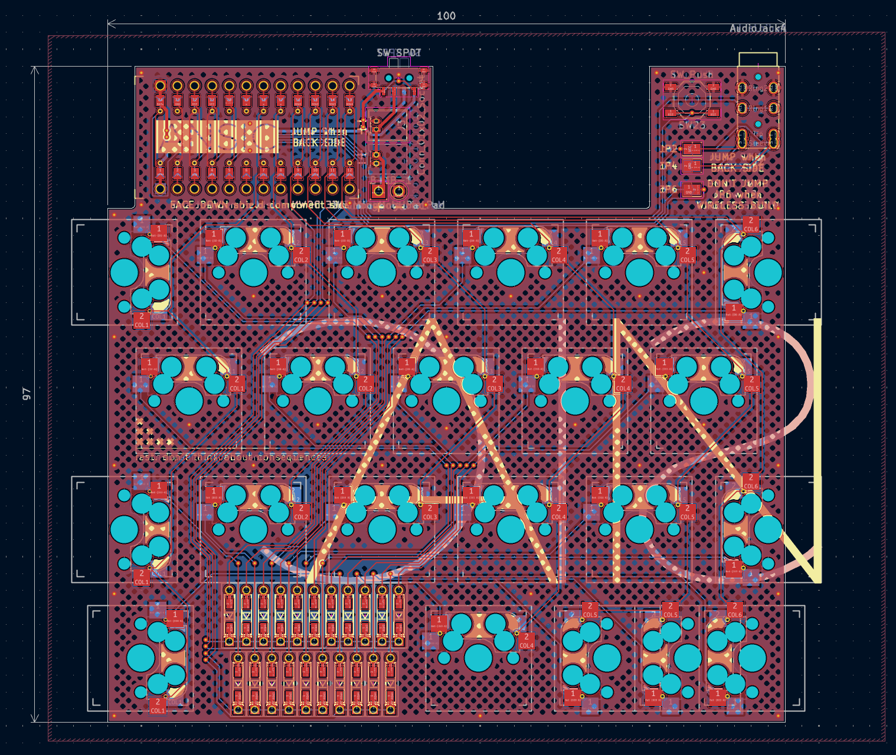

# ANSIC

row staggered 40~42 key split keyboard under 100x100mm PCB

The name "ansic" is sabbath in Korean.

## Preparation

- 2x pro micro (Approx. 4-8$)

- 2x ansic PCB Boards (5 boards are 2$ on JLC w/o shipping cost)

- 1x printed case sets, 6 parts total (Approx. 12$ if you buy printed one on JLC. Use braced ones for 3d print)

- 42x diodes (Approx. 1$)

- 20x M2x6 screws, flathead (Approx. 1$)

- 2x PJ320A 1/8(3.5mm) TRRS connector (Approx. 1$)

- 2x 4x4x1.5mm tact switches (Approx. 1$)

- 1x 1/8(3.5mm) TRRS cable (Approx. 2$, may TRS cable can take the place.)

- 43x MX Hotswap Sockets (Approx. 4$) (or, use soldering version)

- 0~2x Plate Mounted 2u Keyboard Stabilizers (Approx. 1$ when cheap)

- 40~42x MX Keyswitches & Keycaps (Maybe this cost varies too much. 10$ on average)

Approx. 38-43$(w/o shipping cost) needed to build one.

for wireless build, you may additionally need:

- 2x "Wireless" promicro (eg. nrf52840)

- 2x 12c02 slide switch

- 2x xx2030 Li-po battery (eg. 902030) and socket(in 1.25)

## Default Keymap

Holding the key triggers front legend.

There will be two layers - Symbol, Fn - which can be noticed by the color legends. ◇ Means Transparent; which uses base keymap.

## Build Guides

work in progress. sorry!

## Licenses

all codes follow MIT license.

all designs and the hardware board follow CC BY-SA 4.0 license.

If you want to make a commercial product, it would be appreciated if you sponsor some bucks for me.

