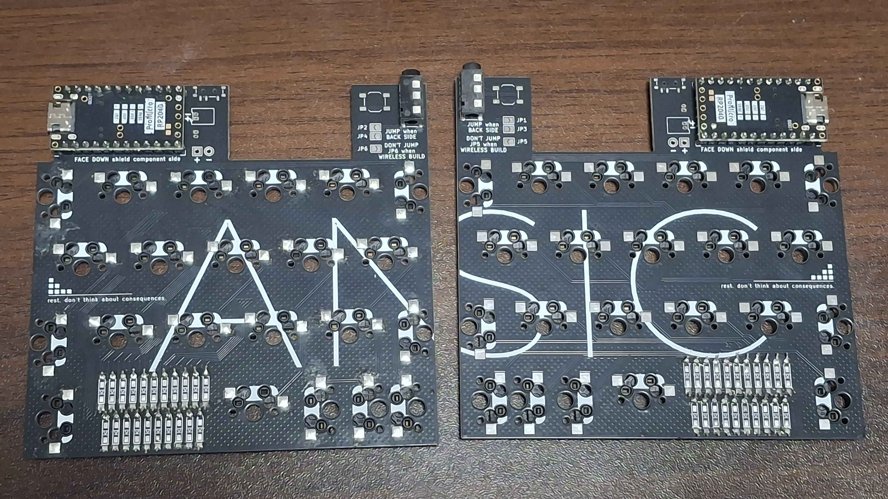
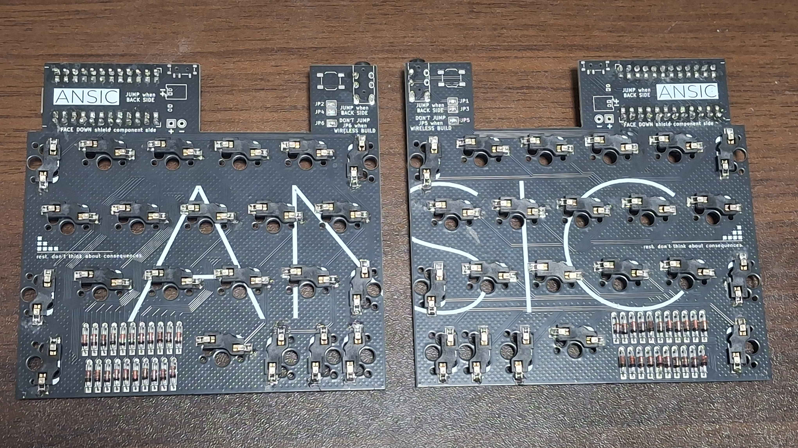
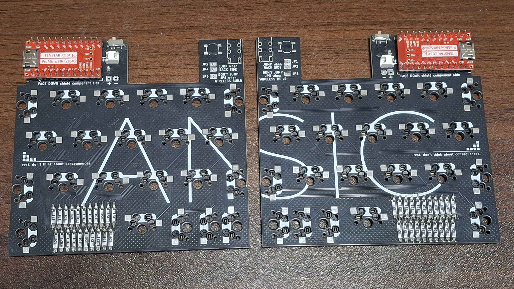
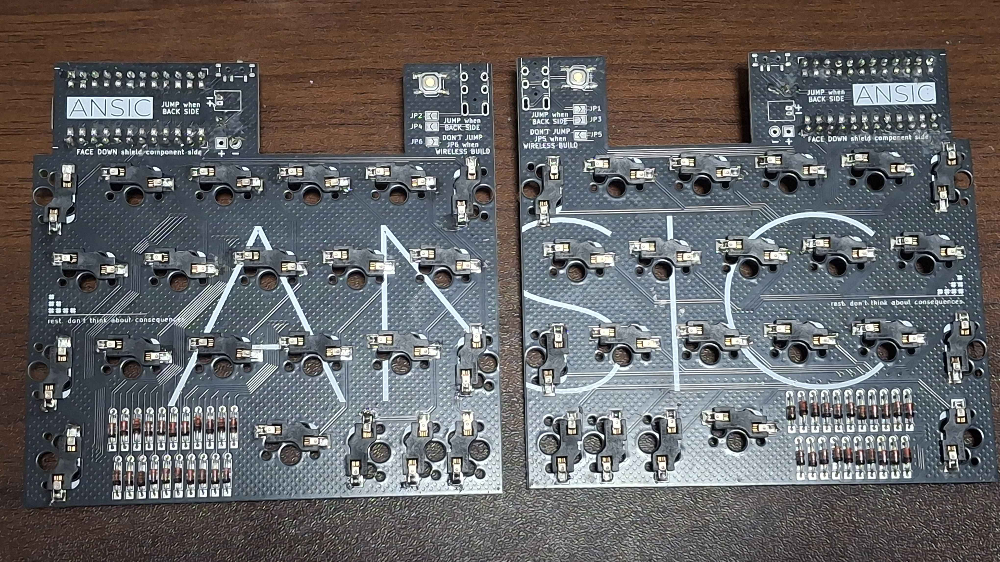

# ANSIC 안식

100x100mm PCB내에 들어가는 40~42키 유니폼 로우스태거(0.5u) 스플릿 키보드입니다.

## 준비물

- 2x 프로마이크로 폼팩터 개발보드 (약 5천~1만원)

- 2x 안식 PCB 보드 (보드 5장에 약 5천원)

- 1x 케이스 세트, 총 2파트 (JLC에서 약 8천원정도 합니다. braced라고 되어있는 강화된 버젼으로 3dp를 맡기는걸 추천드립니다.)

- 2x 보강판 (뽑는 방법에 따라 약 6천~2만원 : 3DP, FR4 fab, CNC, laser cut. etc...)

- 2x 백플레이트 (뽑는 방법에 따라 약 8천~2만5천원 : 3DP, FR4 fab, CNC, laser cut. etc..)

- 42x 다이오드 (약 1천원)

- 20x M2x6 접시머리 나사 (약 1천원)

- 2x PJ320A 3.5mm TRRS 커넥터 (약 1천원)

- 2x 4x4x1.5mm smd 스위치 (약 1천원)

- 1x 3.5mm TRRS 케이블 (약 3천원, TRS 케이블도 사용할 수 있습니다)

- 44x MX 핫스왑 소켓 (약 8천원) (솔더링 버젼으로 pcb를 뽑으면 필요없습니다)

- 0~2x 보강판 체결 2u 스테빌라이저 (진짜 싼 건 약 1천원)

- 40~42x MX 키스위치 & 키캡 (가격대가 너무 다양해서, 평균 3만원 정도로 두겠습니다)

하나 만드는 데 약 7만8천원~11만4천원(배송비 제외)이 필요합니다. 키캡/키스위치나 케이스쪽에서 가격을 더 절약할 수 있습니다.

무선 빌드에는 추가로 다음이 필요합니다.

- 2x "무선" 프로마이크로 폼팩터 개발보드 (nrf52840같은 것들)

- 2x 12c02 슬라이드 스위치 (작고 약하다보니 조심해주세요)

- 2x 케이스용 전원 스위치 파츠

- 2x xx2030 Li-po 배터리 (eg. 902030) 와 소켓(배터리와 호환되는 1.25 형태면 뭐든 좋습니다.)

## 기본 키맵

키를 길게 홀드하면 측각의 내용처럼 기능합니다.

레이어가 두 개 더 있습니다. 각각 Symbol, Fn 이며, 색으로 어떤 레이어에 무슨 키가 할당되어있는지 확인하실 수 있습니다. ◇는 투명 표시이며, 기본 키맵을 이용한단 의미입니다.

## 빌드가이드

작업중입니다. 빌드가이드에 사용할 이미지를 미리 [images](images) 폴더 내에 넣어두었으니 미리 확인하고 싶은 부분을 봐도 좋습니다.

우선 아래의 사진을 참고해 빌드해주세요.

#### 유선

**빌드하기 전 펌웨어를 미리 개발보드에 올려두는 것을 추천드립니다.** 빌드한 후에는 dfu 모드에 들어가기 어렵습니다.

#### 무선

## 주의사항

출시된 버젼에서는 SW21(바깥쪽 썸클러스터입니다)을 기준으로 2.25u 썸클러스터가 작동합니다.

(prototype) 태그가 붙은 파일은 이전에 쓰인 pcb 거버 데이터를 위한 물건입니다. SW20(중앙 썸클러스터입니다)을 기준으로 2.25u 썸클러스터가 작동합니다. 2026년 1월 30일에 올린 거버 파일만 해당됩니다.

## 라이센스

모든 코드 내용은 MIT license를 따릅니다.

모든 디자인과 하드웨어 내용은 CC BY-SA 4.0 license를 따릅니다.

상업제품을 내실 생각이 있다면, 몇 푼만 좀 쥐어주시면 감사하겠습니다...

